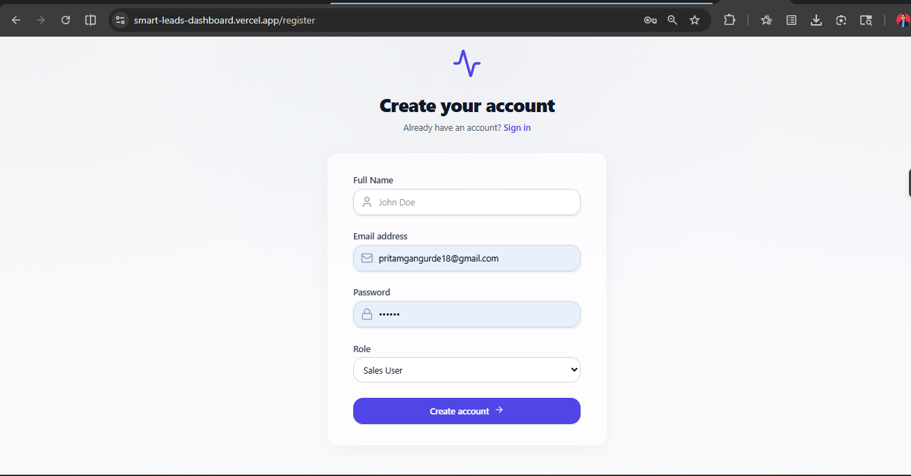
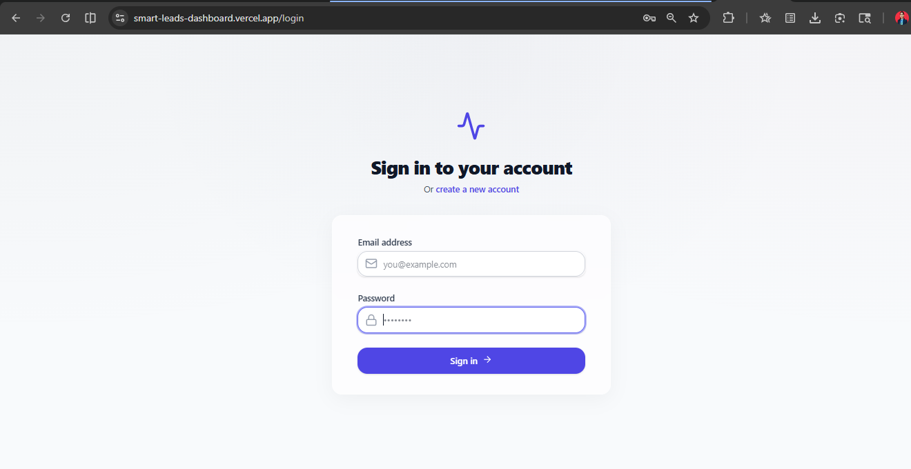
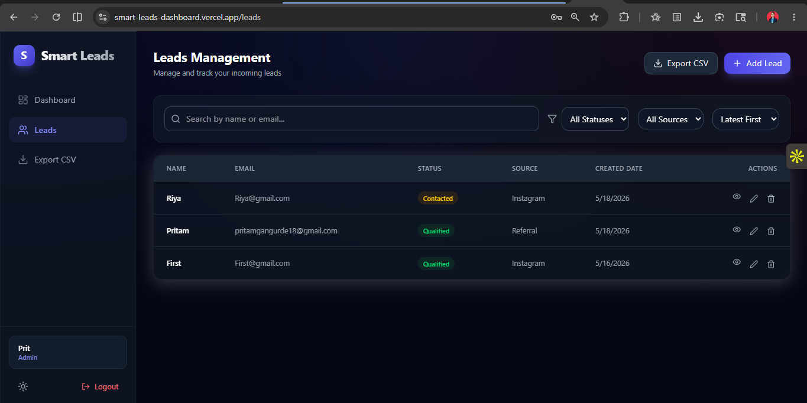

# 🚀 Smart Leads Dashboard

A full-stack MERN Smart Leads Dashboard application built with React, TypeScript, Node.js, Express, MongoDB Atlas, JWT Authentication, Docker, Render, and Vercel.

This project helps manage leads efficiently with authentication, CRUD operations, filtering, pagination, dark mode, CSV export, and Dockerized deployment.

---

# 🌐 Live Demo

## Frontend
https://smart-leads-dashboard.vercel.app

## Backend API
https://smart-leads-dashboard-unqg.onrender.com

---

# 📌 Features

✅ User Authentication (JWT Login/Register)  
✅ Protected Routes  
✅ MongoDB Atlas Integration  
✅ Lead Management System  
✅ Add Leads  
✅ Delete Leads  
✅ Search Leads  
✅ Filter by Status  
✅ Filter by Source  
✅ Export Leads to CSV  
✅ Responsive UI  
✅ Dark Mode Support  
✅ Dockerized Setup  
✅ Cloud Deployment (Render + Vercel)

---

# 🛠️ Tech Stack

## Frontend
- React.js
- TypeScript
- Vite
- Axios
- React CSV

## Backend
- Node.js
- Express.js
- TypeScript
- MongoDB Atlas
- Mongoose
- JWT Authentication

## DevOps & Deployment
- Docker
- Docker Compose
- Render
- Vercel
- GitHub

---

# 📂 Project Structure

```bash
smart-leads-dashboard/
│
├── client/        # Frontend React App
│
├── server/        # Backend Express API
│
├── docker-compose.yml
│
└── README.md
````

---

# ⚙️ Environment Variables

## Backend (`server/.env`)

```env
PORT=5000
MONGO_URI=your_mongodb_connection_string
JWT_SECRET=your_secret_key
```

## Frontend (`client/.env`)

```env
VITE_API_URL=https://your-backend-url/api
```

---

# 🚀 Local Setup

## Clone Repository

```bash
git clone https://github.com/pritt18/Smart-Leads-Dashboard.git
```

---

# 📦 Backend Setup

```bash
cd server
npm install
npm run dev
```

Backend runs on:

```bash
http://localhost:5000
```

---

# 💻 Frontend Setup

```bash
cd client
npm install
npm run dev
```

Frontend runs on:

```bash
http://localhost:5173
```

---

# 🐳 Docker Setup

Run full application using Docker:

```bash
docker compose up --build
```

---

# 🔐 Authentication APIs

## Register

```http
POST /api/auth/register
```

## Login

```http
POST /api/auth/login
```

---

# 📊 Lead APIs

## Get Leads

```http
GET /api/leads
```

## Add Lead

```http
POST /api/leads
```

## Delete Lead

```http
DELETE /api/leads/:id
```

---

# 📸 Screenshots

## Registration Page



## Login Page



## Dashboard


## Leads Page



---
# 👨‍💻 Author

## Pritam Gangurde

* GitHub: [https://github.com/pritt18](https://github.com/pritt18)
* LinkedIn: [https://www.linkedin.com/in/pritam-gangurde-b51528249](https://www.linkedin.com/in/pritam-gangurde-b51528249)

---

# ⭐ Future Improvements

* Edit Lead Feature
* Pagination API
* Role-based Access Control
* Charts & Analytics
* Email Notifications
* Lead Notes & Activity Tracking

---

# 📜 License

This project is licensed under the MIT License.

```
```
